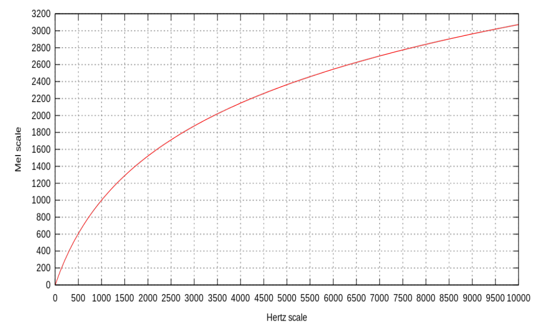
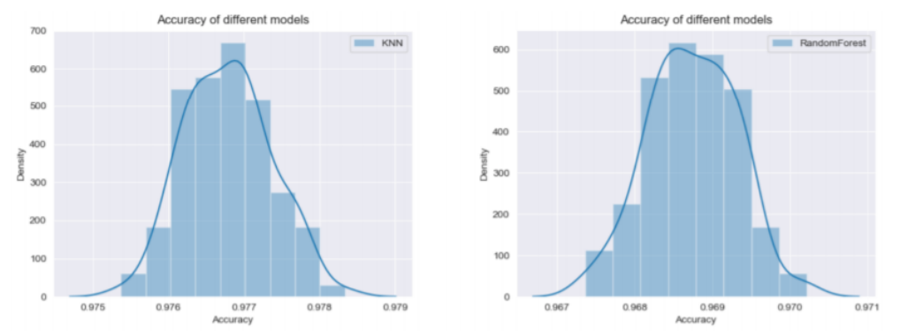

# Project Report on Gender Recognition from Voice Recordings

## 1. Introduction
Gender recognition from voice recordings is crucial for automated speech recognition systems and automated voice response systems. This project aims to simplify and accelerate the processing of human speech and data labeling by using various machine learning methods, primarily neural networks, to improve the accuracy of converting voice recordings into text.

The subject of this project is to simplify and accelerate the processing of human
speech, data labeling. Creating human speech recognition systems Using
Different machine learning techniques, different classes of neural networks are mainly used for this purpose. Since forming neural networks manually requires a
large amount of money and data, additional solutions are used.
This project should help in labeling audio data by gender and the ideas used in this project will provide better accuracy.
ideas used in this project will provide better accuracy in solving the problem of translating audio recordings to text.


## 2. Problem Statement
### 2.1 Informal Problem Statement
Create a training dataset from these voice recordings, train models on them, and predict the gender of a person using test voice recordings.

## 2.2 Formal Problem Statement
A dataset of .wav audio files is provided. Randomly select 80% of these recordings to form an np.array of size 𝑚×𝑛 - the training sample, where the first 𝑛−1 columns are feature values for the respective audio recording fragments, and the 𝑛-th column is the gender of the person to whom the recording belongs. Hence, 𝑚 is the number of such fragments. The resulting array should be passed as a training set to different algorithms from the SciKit-Learn library (hereinafter referred to as sklearn) and prove the hypothesis: **"No matter in which language the model is trained, it will correctly identify the gender of the speaker of any language".**

## 3. Solution Methods
### 3.1 Sound Parameter Description
Mel-frequency cepstral coefficients (MFCC) are chosen as the sound parameters because they are a quantitative estimate based on statistical data about human perception of pitch, which depends non-linearly on frequency. The pitch of sound
perceived by human hearing is nonlinearly dependent on its frequency (see Figure below). 



Graph of dependence of sound height in mels on frequency of oscillation (for pure tone)

Although it's not very precise, it's quite convenient to use because it's
is described by a simple formula: $m = 1127.01048 \times ln (1+\frac{f}{700})$.

### 3.2 Considered Machine Learning Algorithms
For classification, **K Nearest Neighbors (KNN)** and **Random Forest Classifier (RFC)** are used due to their suitability for the task.

- **KNN (K Nearest Neighbors)** is a metric classifier based on object similarity estimation. The object to be classified belongs to the class to which the nearest objects of the training sample belong.
- **RFC (Random Forest Classifier)** is a meta-estimator that maps a number of decision tree classifiers to different subsamples of a dataset and uses averaging to improve class prediction accuracy and control overfitting.


### 3.3 Software Used
- **python_speech_features:** Library used for extracting MEL coefficients from voice recordings.
- **scipy.io.wavfile:** Library for processing .wav audio files.
- **Anaconda:** Free Python and R distribution for scientific computing.
- **Pandas:** Library for data manipulation with objects like Series and DataFrame.
- **SciKit-Learn:** Library that implements main machine learning algorithms.
- **Pickle:** Module used for saving the best models after training.
- **Matplotlib.pyplot:** Library for creating required plots and data visualization.
- **NumPy:** Essential for performing calculations and storing large data arrays efficiently.
- **speech_recognition and pyaudio:** Libraries necessary for recording voice directly in the program.

## 4. Implementation of the solution
### 4.1 Creating a Database
To implement machine learning (in our case, supervised learning since we are using classifiers), a database of labeled data is necessary, where an important part of the features is already divided into separate categories or classes. Therefore, we will create such a database, which consists of extracted MEL coefficients from audio recordings. We take 16 audio recordings (8 male, 8 female). First of all, let's explain the parameters of the `mfcc()` function that were taken and why.

- `sig` – the audio signal for calculating features.
- `rate` – the sampling rate.
- `winlen` - the length of the analysis window in seconds. By default, it is 0.025 s (25 milliseconds). We will set this parameter at 0.2 s.
- `winstep` - the step between successive windows in seconds. By default, 0.01 s (10 milliseconds). We will set this value to 0.01 s.
- `nfilt` - the number of filters in the filter bank, by default 26. For our task, 26 filters are suitable. We will keep this value.
- `nfft` - the size of the FFT. By default, 512. We will need a value of 12512.
- `lowfreq` - the lower boundary of the mel filter band in Hz, by default 0. This value is suitable for us.
- `highfreq` - the maximum edge of the mel filter band. For our task, a value of 22050 Hz will work.
- `preemph` - apply preemphasis filter with preemph as the coefficient. By default 0.97. We do not need this filter. We will set it to 0.

**Program Code:**
```python
from python_speech_features import mfcc
import scipy.io.wavfile as wav
import numpy as np
import pandas as pd
from sklearn import preprocessing

def make_data(name, dfa):
    (rate, sig) = wav.read(name)
    mfcc_feat = mfcc(sig, rate, winlen=0.2, winstep=0.01,
                     nfilt=26, nfft=12512, lowfreq=0,
                     highfreq=22050, preemph=0)
    res_shape = np.shape(mfcc_feat)
    df = pd.DataFrame(mfcc_feat)
    if name.find("woman") != -1:
        df['SEX'] = pd.Series([0] * res_shape[0], index=df.index)
    elif name.find("man") != -1:
        df['SEX'] = pd.Series([1] * res_shape[0], index=df.index)
    else:
        print("Wrong name of the recording.")
        exit(1)
    dfa = dfa.append(df)
    return dfa

# Creating an empty dataframe to pass to functions
df_all = pd.DataFrame()

i = 1
while i < 9:
    df_all = make_data("./training/man.wav".format(i), df_all)
    df_all = make_data("./training/woman.wav".format(i), df_all)
    i += 1

# convert the obtained dataframe to csv format
df_all.to_csv("filedata.csv")

# normalize the data of filedata.csv
min_max_scaler = preprocessing.MinMaxScaler()
np_scaled = min_max_scaler.fit_transform(df_all)
df_normalized = pd.DataFrame(np_scaled)
df_normalized.to_csv("filedata_norm.csv")
```

At the end, we generate two CSV format files: "filedata.csv" and "filedata_norm.csv" (normalized data from "filedata.csv").

### 4.2 Training the Neural Network Classifier with KNN
**Program Code:**
```python
import numpy as np
import pandas as pd
import pickle
from sklearn.model_selection import GridSearchCV
from sklearn.neighbors import KNeighborsClassifier
from sklearn.metrics.precision_score

frame = pd.read_csv("filedata_norm.csv", delimiter=',', index_col=0)
x_train = frame.iloc[:, :13].to_numpy()
y_train = frame.iloc[:, 13].to_numpy()

tuned_parameters = {
    "weights": np.array(["uniform", "distance"]),
    "algorithm": np.array(["ball_tree", "kd_tree", "brute"]),
    "p": np.array([2, 12]),
}

model = GridSearchCV(KNeighborsClassifier(), tuned_parameters, cv=14)
model.fit(x_train, y_train)

best_model = model.best_estimator_
y_true = y_train
y_pred = best_model.predict(x_train)
precision = precision_score(y_true, y_pred, average='weighted')
print(precision)
if precision >= 0.95:
    with open("knn_params.pickle", "wb") as fout:
        pickle.dump(best_model.get_params(), fout)
    fout.close()

    with open("knn_best_model.sav", "wb") as fout:
        pickle.dump(best_model, fout)
    fout.close()
```

After compiling, two files are created: "knn_params.pickle" and "knn_best_model.sav", which store information about the best model as a result of training.

### 4.3 Training the Neural Network Classifier with RFC (Random Forest Classifier)
**Program Code:**
```python
import pandas as pd
import numpy as np
import pickle
from sklearn.ensemble import RandomForestClassifier
from sklearn.model_selection import GridSearchCV
from sklearn.metrics import precision_score

frame = pd.read_csv("filedata_norm.csv", delimiter=',', index_col=0)
x_train = frame.iloc[:, :13].to_numpy()
y_train = frame.iloc[:, 13].to_numpy()

tuned_parameters = {
    "n_estimators": np.array([50, 100, 150]),
    "criterion": np.array(["gini", "entropy"]),
    "max_features": np.array(["sqrt", "log2", None])
}

model = GridSearchCV(RandomForestClassifier(), tuned_parameters, cv=14)
model.fit(x_train, y_train)
best_model = model.best_estimator_
y_true = y_train
y_pred = best_model.predict(x_train)
precision = precision_score(y_true, y_pred, average='weighted')
print(precision)

if precision >= 0.95:
    with open("rfc_params.pickle", "wb") as fout:
        pickle.dump(best_model.get_params(), fout)
    fout.close()

    with open("rfc_best_model.sav", "wb") as fout:
        pickle.dump(best_model, fout)
    fout.close()
```

### 4.4 Main Program Used for Testing Models
This consists of the `make_data` function used for extracting MEL coefficients from the audio recording.

Then there's the `voice_to_numpy` function, which normalizes the MEL coefficients and records the resulting array in NumPy format:

**Program Code:**
```python
def voice_to_numpy(name):
    frame = pd.DataFrame()
    frame = make_data(name, frame)
    min_max_scaler = preprocessing.MinMaxScaler()
    np_scaled = min_max_scaler.fit_transform(frame)
    frame_normalized = pd.DataFrame(np_scaled)
    data = frame_normalized.to_numpy()
    return data
```
Choosing one of the two classifiers to extract the best model content in pickle format:

```python
if key == 1:
    with open("knn_best_model.sav", "rb") as fin:
        model = pickle.load(fin)
elif key == 2:
    with open("rfc_best_model.sav", "rb") as fin:
        model = pickle.load(fin)
``` 

Finally, calculate the average of the predicted gender columns using NumPy's "mean" function:

```python
result = np.mean(model.predict(data))
if result < 0.5:
    print("Female")
    print(result)
elif result > 0.5:
    print("Male")
    print(result)
else:
    print("Undetermined.")
    print(result)
```

### 4.5 Comparison of KNN and RFC classifiers
The input data (audio recording of Russian mono-sound speakers with wav extension) is a time series - a sequence of measurements during each measurement, characterized by the corresponding vector of MEL coefficients. Let us consider the efficiency of machine learning algorithms and construct comparative graphs on standard parameters using Matplotlib library:



From this figure, we can observe that our KNN and RFC models show an accuracy of about 97%, which is excellent for machine learning.

## 5. Tests
In the previous paragraph, we compared 2 algorithms (knn and rfc). The input data were audio recordings in Russian.
Below is the table where the input data were audio recordings in different languages.
As can be seen, although with a small error, but the developed model correctly determines the gender of the speaker of a foreign language, despite the fact that it was trained on the Russian speech recordings.

| Record Number | Language | Classifier | Gender | Result |
|---------------|----------|------------|--------|--------|
| 1             | English  | KNN        | Male   | <span style="background-color: #ffcccc">Female (0.243)</span> |
| 1             | English  | RFC        | Male   | <span style="background-color: #ffcccc">Female (0.342)</span> |
| 2             | English  | KNN        | Female | <span style="background-color: #ccffcc">Female (0.267)</span> |
| 2             | English  | RFC        | Female | <span style="background-color: #ccffcc">Female (0.187)</span> |
| 3             | German   | KNN        | Male   | <span style="background-color: #ccffcc">Male (0.509)</span> |
| 3             | German   | RFC        | Male   | <span style="background-color: #ccffcc">Male (0.564)</span> |
| 4             | German   | KNN        | Female | <span style="background-color: #ccffcc">Female (0.438)</span> |
| 4             | German   | RFC        | Female | <span style="background-color: #ccffcc">Female (0.213)</span> |
| 5             | French   | KNN        | Male   | <span style="background-color: #ccffcc">Male (0.611)</span> |
| 5             | French   | RFC        | Male   | <span style="background-color: #ccffcc">Male (0.506)</span> |
| 6             | French   | KNN        | Female | <span style="background-color: #ccffcc">Female (0.335)</span> |
| 6             | French   | RFC        | Female | <span style="background-color: #ccffcc">Female (0.212)</span> |
| 7             | Spanish  | KNN        | Male   | <span style="background-color: #ccffcc">Male (0.619)</span> |
| 7             | Spanish  | RFC        | Male   | <span style="background-color: #ccffcc">Male (0.758)</span> |
| 8             | Spanish  | KNN        | Female | <span style="background-color: #ccffcc">Female (0.473)</span> |
| 8             | Spanish  | RFC        | Female | <span style="background-color: #ccffcc">Female (0.292)</span> |
| 9             | Vietnamese | KNN      | Male   | <span style="background-color: #ccffcc">Male (0.561)</span> |
| 9             | Vietnamese | RFC      | Male   | <span style="background-color: #ccffcc">Male (0.230)</span> |
| 10            | Vietnamese | KNN      | Female | <span style="background-color: #ccffcc">Female (0.387)</span> |
| 10            | Vietnamese | RFC      | Female | <span style="background-color: #ccffcc">Female (0.244)</span> |
| 11            | Georgian   | KNN      | Male   | <span style="background-color: #ccffcc">Male (0.681)</span> |
| 11            | Georgian   | RFC      | Male   | <span style="background-color: #ccffcc">Male (0.565)</span> |
| 12            | Georgian   | KNN      | Female | <span style="background-color: #ccffcc">Female (0.438)</span> |
| 12            | Georgian   | RFC      | Female | <span style="background-color: #ffcccc">Male (0.723)</span> |
| 13            | Azerbaijani | KNN     | Male   | <span style="background-color: #ccffcc">Male (0.554)</span> |
| 13            | Azerbaijani | RFC     | Male   | <span style="background-color: #ccffcc">Male (0.703)</span> |
| 14            | Azerbaijani | KNN     | Female | <span style="background-color: #ccffcc">Female (0.476)</span> |
| 14            | Azerbaijani | RFC     | Female | <span style="background-color: #ccffcc">Female (0.408)</span> |


## 6. Results
A program was developed that determines the gender of a speaker from an audio recording. The hypothesis was tested and confirmed: **"No matter what language the model is trained in, it will correctly identify the gender of the speaker of any language"**. 